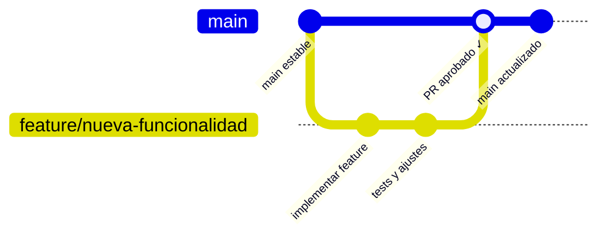

# ⚽ BalónGo — Sistema de Gestión de Pedidos y Entregas

> **Distribuidora Rogas S.R.L.** — Gestión integral de pedidos de balones de gas con seguimiento en tiempo real.

---

## 📊 Tecnologías Utilizadas


---

## 🚀 Funcionalidades

| Módulo | Descripción |
|---|---|
| 🔐 **Autenticación** | Login con Firebase Auth, AuthGuard en rutas privadas |
| 👥 **Clientes** | CRUD completo, búsqueda, validación de duplicados por teléfono |
| 📦 **Pedidos** | Crear pedidos, asignar repartidor, transición de estados |
| 📊 **Dashboard** | Conteos en tiempo real (pendientes, en reparto, entregados) |
| 📋 **Historial** | Registro de entregas con filtros por fecha y búsqueda |
| 👤 **Perfil** | Datos del usuario, estadísticas, cambio de contraseña |
| 🔔 **Feedback** | Toasts de confirmación en cada acción del usuario |

### Flujo de un pedido
```
📥 Pendiente  →  🚚 En proceso  →  ✅ Entregado
```

---

## 🗺️ Tabla de Contenidos
1. [Requisitos Previos](#️-requisitos-previos)
2. [Instalación](#-instalación)
3. [Configuración de Firebase](#-configuración-de-firebase)
4. [Ejecución Local](#-ejecución-local)
5. [Estructura del Proyecto](#-estructura-del-proyecto)
6. [Flujo de Desarrollo (Git)](#-flujo-de-desarrollo-git)
7. [Comandos Útiles](#-comandos-útiles)

---

## 🛠️ Requisitos Previos

| Herramienta | Versión mínima | Verificar |
|---|---|---|
| **Node.js** | v20+ | `node -v` |
| **npm** | v10+ | `npm -v` |
| **Git** | 2.x+ | `git --version` |
| **Editor** | VS Code (recomendado) | — |

---

## 📥 Instalación

```bash
# 1. Clonar el repositorio
git clone https://github.com/zSnowww/BalonGo.git

# 2. Entrar al proyecto
cd BalonGo

# 3. Instalar dependencias
npm install

# 4. Abrir en VS Code
code .
```

---

## 🔥 Configuración de Firebase

BalónGo usa **Firebase** para autenticación (Auth) y base de datos (Firestore).

### Paso 1: Crear proyecto en Firebase Console
1. Ve a [console.firebase.google.com](https://console.firebase.google.com/)
2. Crea un proyecto o usa uno existente
3. Habilita **Authentication** → método **Email/Password**
4. Habilita **Cloud Firestore** en modo de prueba

### Paso 2: Configurar credenciales
Crea el archivo `src/environments/environment.ts` con tus credenciales:

```typescript
export const environment = {
  production: false,
  firebase: {
    apiKey: "TU_API_KEY",
    authDomain: "TU_PROYECTO.firebaseapp.com",
    projectId: "TU_PROJECT_ID",
    storageBucket: "TU_PROYECTO.appspot.com",
    messagingSenderId: "123456789",
    appId: "1:123456789:web:abcdef"
  }
};
```

> [!IMPORTANT]
> El archivo `environment.ts` está en `.gitignore` por seguridad. **Nunca subas tus credenciales de Firebase a GitHub.**

### Paso 3: Crear usuario administrador
En Firebase Console → Authentication → Users → **Add User** con email y contraseña.

---

## ⚡ Ejecución Local

```bash
# Levantar el servidor de desarrollo
npm start
```

La app se abrirá en `http://localhost:4200`. Los cambios se reflejan al instante gracias al hot reload.

> [!NOTE]
> Para detener el servidor: `Ctrl + C` en la terminal.

---

## 📁 Estructura del Proyecto

```
src/
├── app/
│   ├── guards/
│   │   └── auth.guard.ts          # Protección de rutas
│   ├── models/
│   │   ├── cliente.model.ts       # Interfaz de Cliente
│   │   └── pedido.model.ts        # Interfaz de Pedido + estados
│   ├── pages/
│   │   ├── login/                 # Pantalla de inicio de sesión
│   │   ├── dashboard/             # Panel principal con estadísticas
│   │   ├── clientes/              # CRUD de clientes
│   │   ├── pedidos/               # Gestión de pedidos
│   │   ├── historial/             # Historial de entregas
│   │   └── perfil/                # Perfil y configuración
│   ├── services/
│   │   ├── auth.service.ts        # Firebase Auth (SDK directo)
│   │   ├── clientes.ts            # Firestore CRUD clientes
│   │   └── pedidos.service.ts     # Firestore CRUD pedidos
│   ├── app.component.ts
│   └── app.routes.ts              # Rutas con lazy loading
├── environments/
│   └── environment.ts             # Credenciales Firebase (git-ignored)
└── main.ts                        # Bootstrap con Firebase init
```

---

## 🌿 Flujo de Desarrollo (Git)

> [!WARNING]
> **NUNCA** subas cambios directamente a `main`. Toda nueva funcionalidad debe hacerse en su propia **rama**.



### Paso a paso

```bash
# 1. Partir del código más reciente
git checkout main
git pull

# 2. Crear rama de trabajo
git checkout -b feature/nombre-de-la-tarea

# 3. Programar y probar localmente con npm start

# 4. Guardar cambios
git add .
git commit -m "feat: descripción clara del cambio"

# 5. Subir rama a GitHub
git push -u origin feature/nombre-de-la-tarea

# 6. Crear Pull Request en GitHub y solicitar revisión
```

### Convención de ramas
| Prefijo | Uso |
|---|---|
| `feature/` | Nuevas funcionalidades |
| `bugfix/` | Corrección de errores |
| `refactor/` | Mejoras de código sin cambiar funcionalidad |

---

## 🧰 Comandos Útiles

| Comando | Propósito |
|---|---|
| `npm start` | Levantar servidor de desarrollo |
| `npm run build` | Compilar para producción |
| `npm run lint` | Analizar calidad de código |
| `git status` | Ver archivos modificados |
| `git branch` | Listar ramas locales |

---

## 👥 Equipo

**Distribuidora Rogas S.R.L.** — Lima, Perú

---

**BalónGo v1.0** — Hecho con ❤️ usando Angular, Ionic y Firebase 🚀
