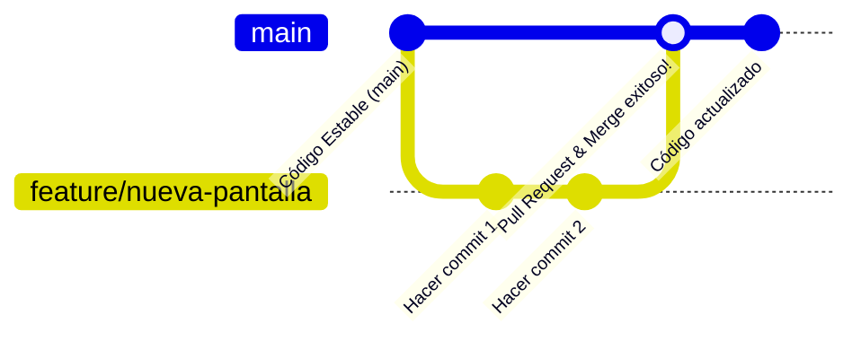

# 🦁 Gastonsillo — Guía de Inicio Rápido

Bienvenido a **Gastonsillo**, una aplicación móvil y web híbrida desarrollada con **Ionic Framework** y **Angular**. 

Esta guía está diseñada de forma **sencilla y a prueba de errores** para que cualquier desarrollador (sin importar su nivel de experiencia) pueda clonar el proyecto, preparar el entorno de desarrollo, levantar la aplicación en su máquina local y colaborar de forma ordenada siguiendo las mejores prácticas de Git.

---

## 📊 Tecnologías Utilizadas

Para facilitar el desarrollo, el proyecto utiliza las siguientes tecnologías clave:


---

## 🗺️ Tabla de Contenidos
1. [🛠️ Requisitos Previos (Instalar Primero)](#️-requisitos-previos-instalar-primero)
2. [📥 Paso 1: Descargar el Proyecto (Clonar)](#-paso-1-descargar-el-proyecto-clonar)
3. [⚙️ Paso 2: Preparar el Entorno (Instalar dependencias)](#️-paso-2-preparar-el-entorno-instalar-dependencias)
4. [⚡ Paso 3: Levantar la Web (Ejecutar en local)](#-paso-3-levantar-la-web-ejecutar-en-local)
5. [🌿 Paso 4: Cómo Desarrollar una Nueva Feature (Flujo de Ramas)](#-paso-4-cómo-desarrollar-una-nueva-feature-flujo-de-ramas)
6. [🧰 Comandos Útiles de Utilidad](#-comandos-útiles-de-utilidad)

---

## 🛠️ Requisitos Previos (Instalar Primero)

Antes de tocar cualquier línea de código, necesitas tener instaladas estas **3 herramientas básicas** en tu computadora:

### 1. Git (Control de Versiones)
Es el programa que te permite descargar el código y registrar tus cambios.
*   **Descarga:** [Descargar Git para Windows/Mac/Linux](https://git-scm.com/downloads)
*   **¿Cómo verificar si lo tengo?** Abre tu terminal (consola de comandos) y escribe:
    ```bash
    git --version
    ```

### 2. Node.js (Entorno de Ejecución)
Es el motor que permite ejecutar y compilar nuestra aplicación Angular e Ionic en la máquina. Recomendamos la versión **LTS** (actualmente v20 o superior).
*   **Descarga:** [Descargar Node.js LTS](https://nodejs.org/)
*   **¿Cómo verificar si lo tengo?** Abre tu terminal y escribe:
    ```bash
    node -v
    npm -v
    ```
    *(Ambos comandos deberían mostrarte números de versión, ej: `v20.x.x` y `10.x.x`)*

### 3. Editor de Código (Recomendado: VS Code)
Para escribir y editar el código cómodamente.
*   **Descarga:** [Descargar Visual Studio Code](https://code.visualstudio.com/)

---

## 📥 Paso 1: Descargar el Proyecto (Clonar)

Una vez que tengas Git instalado, es hora de traer el proyecto a tu computadora local.

1. Abre la terminal de tu sistema (PowerShell en Windows, Terminal en Mac, o la integrada de VS Code).
2. Navega a la carpeta donde quieras guardar el proyecto. Por ejemplo, en Windows:
   ```powershell
   cd C:\Users\TuUsuario\Documents
   ```
3. Ejecuta el comando para descargar (clonar) el repositorio:
   ```bash
   git clone <URL_DE_ESTE_REPOSITORIO>
   ```
   *(Reemplaza `<URL_DE_ESTE_REPOSITORIO>` con el enlace HTTPS o SSH que copiaste de GitHub)*
4. Entra a la carpeta recién creada del proyecto:
   ```bash
   cd Proyecto
   ```
5. Abre la carpeta en Visual Studio Code. En la terminal puedes escribir:
   ```bash
   code .
   ```

---

## ⚙️ Paso 2: Preparar el Entorno (Instalar dependencias)

El código descargado no incluye todas las librerías de Angular e Ionic porque son muy pesadas para guardarse en GitHub. Debemos descargarlas localmente.

> [!IMPORTANT]
> Asegúrate de estar dentro de la carpeta raíz del proyecto (`Proyecto`) en tu terminal antes de correr este comando.

1. En la terminal de VS Code (abre una con `Ctrl + Shift + \`` o desde el menú `Terminal -> New Terminal`), ejecuta:
   ```bash
   npm install
   ```
2. Este comando leerá el archivo `package.json` y descargará de forma automática todas las dependencias necesarias en una carpeta llamada `node_modules`.

> [!TIP]
> **¿Da algún error de compatibilidad?** 
> Si por alguna razón la instalación falla por conflictos de versiones de paquetes antiguos, usa el comando de fuerza segura:
> ```bash
> npm install --legacy-peer-deps
> ```

---

## ⚡ Paso 3: Levantar la Web (Ejecutar en local)

Una vez instaladas las dependencias, ¡ya puedes ver la web en funcionamiento en tu navegador!

Para levantar el servidor de desarrollo local, tienes dos comandos equivalentes excelentes:

### Opción A (Recomendada con NPM estándar)
```bash
npm start
```
*Este comando corre internamente `ng serve`, levantando la aplicación mediante Angular CLI.*

### Opción B (Usando Ionic CLI de forma directa)
```bash
npx ionic serve
```
*Este comando utiliza el CLI de Ionic para arrancar el servidor en un puerto amigable.*

### 🔍 ¿Qué pasa al ejecutar esto?
1. La terminal compilará el código (tarda unos segundos la primera vez).
2. Verás un mensaje que dice: `** Angular Live Development Server is listening on localhost:4200, open your browser on http://localhost:4200/ **`.
3. Tu navegador web predeterminado **se abrirá automáticamente** en la dirección correspondiente (normalmente `http://localhost:4200` o `http://localhost:8100`).
4. **¡Cualquier cambio que guardes en el código se reflejará al instante en tu navegador sin necesidad de recargar manualmente!**

> [!NOTE]
> **¿Cómo apago el servidor?**
> Para detener la ejecución del servidor local en cualquier momento, ve a la terminal donde se está ejecutando y presiona la combinación de teclas:
> `Ctrl + C` (y luego escribe `S` o `Y` si te pregunta para confirmar y presiona `Enter`).

---

## 🌿 Paso 4: Cómo Desarrollar una Nueva Feature (Flujo de Ramas)

> [!WARNING]
> **REGLA DE ORO DE GITHUB:** 
> **NUNCA** subas cambios directamente a la rama `main` (principal). Si lo haces, podrías romper el código estable que ya funciona o causar graves conflictos con el código de tus compañeros.
> Toda nueva funcionalidad, mejora o corrección de error debe hacerse trabajando en su propia **rama (branch)**.

### 🗺️ El Flujo de Trabajo Visual

El siguiente diagrama muestra el flujo correcto que debes seguir desde que decides hacer una tarea hasta que tus cambios se incorporan al proyecto final:



### 📋 Paso a Paso para crear una Nueva Feature (Ejemplo Real)

Sigue estos **7 pasos estrictamente** cada vez que vayas a programar una nueva tarea:

#### 1. Asegúrate de estar en `main` y con el código actualizado
Antes de crear una rama, debes partir del código más reciente:
```bash
git checkout main
git pull
```

#### 2. Crea tu nueva rama de trabajo
Crea una rama con un nombre descriptivo usando el prefijo adecuado:
*   Para nuevas funcionalidades: `feature/nombre-de-la-tarea`
*   Para arreglar errores: `bugfix/nombre-del-error`
*   Para refactorizar código: `refactor/que-refactorizas`

*Ejemplo:*
```bash
git checkout -b feature/pantalla-login
```
*(El parámetro `-b` le dice a git que cree la rama y `checkout` te cambia a ella inmediatamente)*

#### 3. Escribe tu código y haz pruebas locales
Programa tu feature en VS Code y comprueba en tu navegador (con `npm start`) que funciona correctamente y no tiene fallos.

#### 4. Revisa tus archivos modificados
Para ver qué archivos has cambiado o agregado, escribe:
```bash
git status
```

#### 5. Guarda tus cambios localmente (Commits)
Añade los archivos que quieres guardar y crea un commit con un mensaje descriptivo en presente y español (o inglés si tu equipo lo requiere):
```bash
# 1. Agrega todos los archivos modificados al "carrito de compras"
git add .

# 2. Crea la foto/punto de restauración de tus cambios con una explicación clara
git commit -m "feat: agrega formulario y lógica para la pantalla de login"
```

#### 6. Sube tu rama a GitHub
Sube tu rama local para que esté disponible en la nube en GitHub:
```bash
git push -u origin feature/pantalla-login
```
*(El parámetro `-u` solo se necesita la primera vez que subes la rama, luego basta con hacer solo `git push`)*

#### 7. Crea un Pull Request (PR) y solicita revisión
1. Entra a la página de este repositorio en GitHub.
2. Verás un cartel amarillo destacado que dice: **"Compare & pull request"**. Haz clic en él.
3. Escribe una descripción de lo que has hecho y qué se debe probar.
4. Asigna revisores (compañeros de equipo) si aplica.
5. Una vez que pase la revisión y las pruebas automáticas, se podrá hacer **Merge** (combinación) con la rama `main` y tu código ya formará parte del proyecto oficial. ¡Felicidades! 🎉

---

## 🧰 Comandos Útiles de Utilidad

Aquí tienes una lista de comandos rápidos que te pueden ayudar en el día a día:

| Comando | Propósito | ¿Cuándo usarlo? |
|---|---|---|
| `git status` | Ver qué archivos has modificado o están pendientes de guardar | A cada rato, para saber el estado de tu código |
| `git branch` | Listar todas tus ramas locales e identificar en cuál estás | Para asegurarte de no estar programando en `main` |
| `npm run lint` | Ejecuta el analizador estático de código para buscar malas prácticas | Antes de hacer un commit, para asegurarte de que tu código está impecable |
| `npm run test` | Ejecuta las pruebas unitarias integradas con Karma | Para validar que los cambios no rompieron funcionalidades existentes |
| `npm run build` | Compila la aplicación optimizándola para producción | Cuando se prepare la app para subirla a un servidor web real |

---
**¡Listo! Ya tienes todo el conocimiento necesario para dominar el desarrollo en este repositorio. Si tienes dudas, consulta a tu líder técnico o abre un Issue en GitHub. ¡Feliz programación! 🚀**
